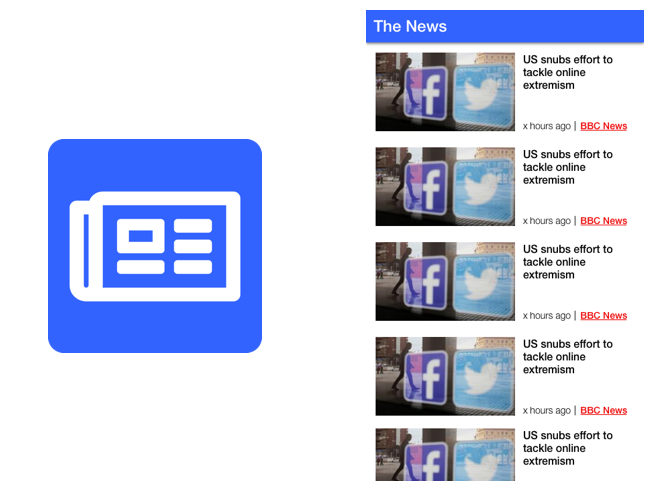

# The News 

> A news app written using Web Components

  

## Development

1. You need to install the node deps by doing and `npm i` in the root directory
2. Once you have done this you can run `npm start` and it will run rollup with a watcher and run a http-server on the docs folder
